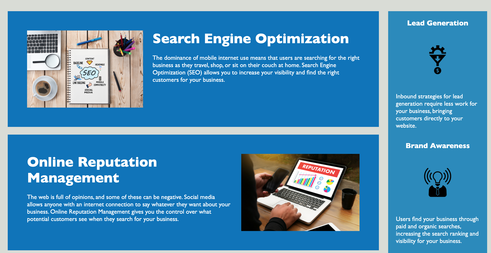
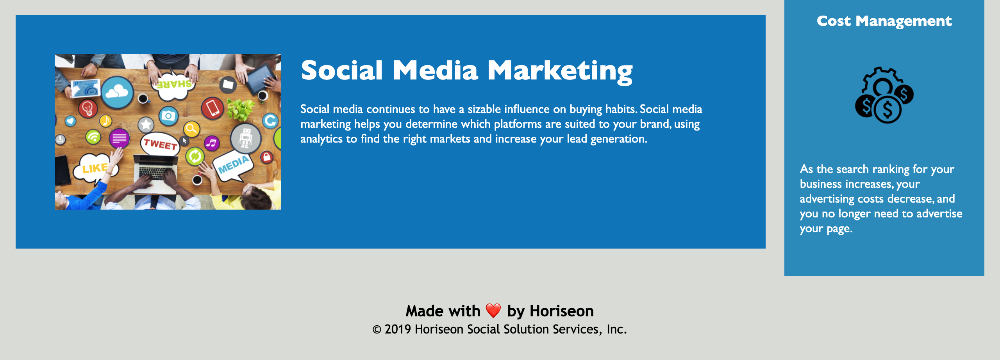

# horiseon-social-solution-services
* As a developer, I created a website that follows accessiblity standards. This
ensures our site is optimized for search engines.

## About the Project
This project improved accessibility of Horiseon Social Solution Services' website. It includes alt text for each image displayed, as well as semantic html elements. Elements follow a logical structure and heading attributes fall in sequential order.

## Screenshot
Here are sample images of how the site looks, in sequential order from top of site to bottom:

## Getting Started

Enter the following link in your browser to access this project:

https://vbmisra.github.io/horiseon-social-solution-services/
